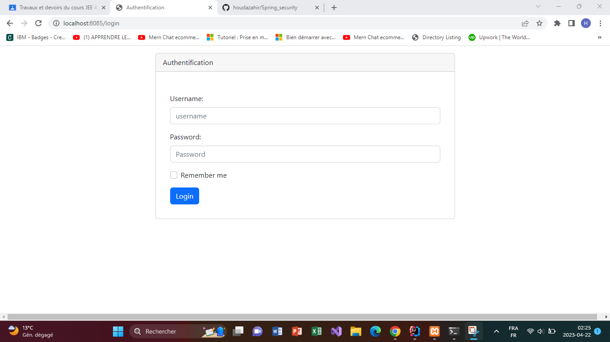
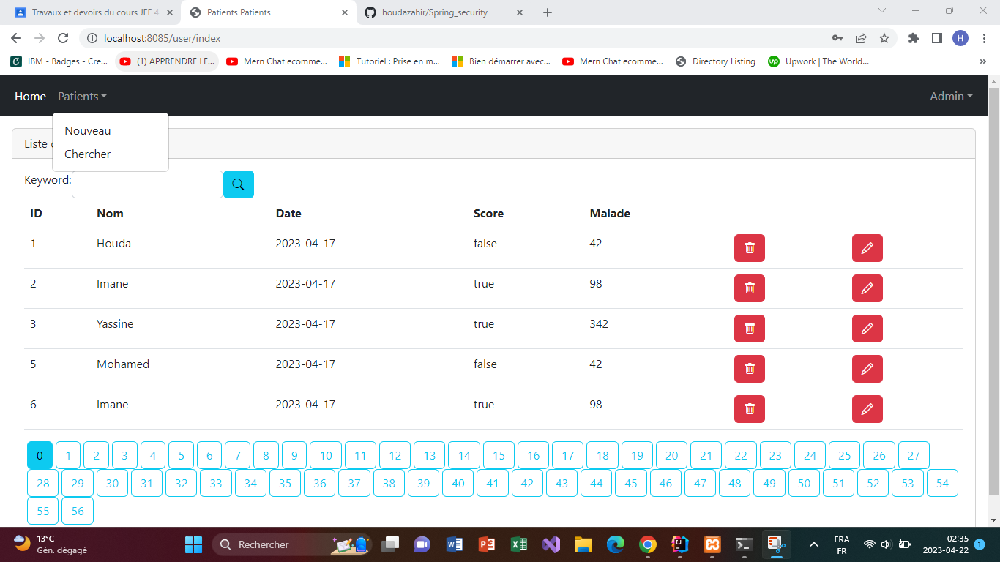
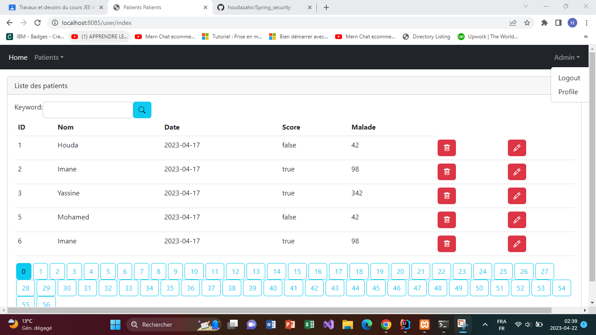
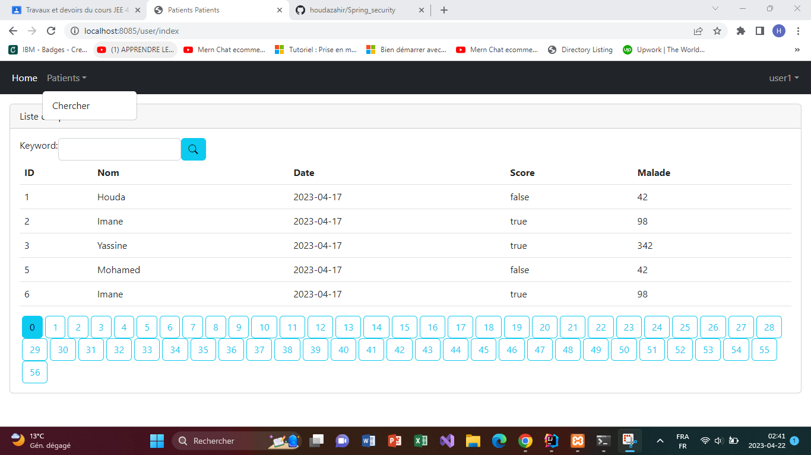

<h3>Compte rendu</h3>

La page ci-dessus présente un formulaire d'authentification (afin de sécuriser l'application), 
ce dernier donne l'accès à des fonctionnalités selon le role (administrateur ou utilisateur ordinaire). 
La fontionnalité Remember me permet de mémoriser les informations, et cependant faciliter la connexion pour une prochaine fois.

En étant authentifié comme administrateur, ci-dessus les droits qu'on possède. 
Un admin peut ajouter, editer, supprimer ou chercher un patient.

Afin de se déconnecter, il suffit de cliquer sur le boutton Logout, et on sera redirigé vers l'interface d'authentification à nouveau.

En étant connecter avec un compte user, on a accès qu'à la fonctionnalité de recherche.

